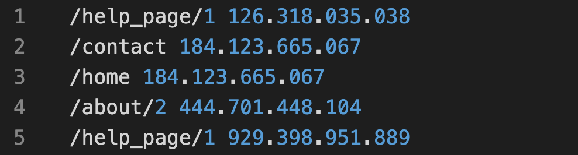
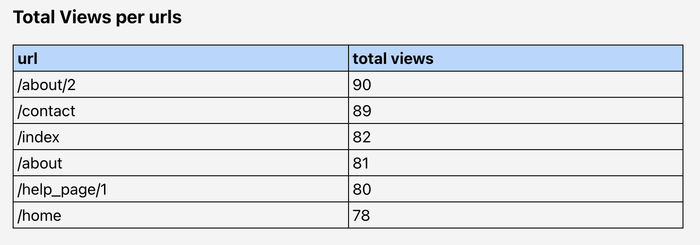

# Log App started with Create React App

This Log App was bootstrapped with Create React App using the typescript template.

## Log App functionality

The user can select a ".log" file containing on each lines urls and ips:

```
/home   123.100.100.100
/about  130.100.100.100
```

here an image as example:


The application will parse the file and it will generate two objects ordered from the most views to least page views:

example of totalViews object:

```
{
    0:{
        url: "/home",
        count: 4,
        ips: ["123.100.100.100", ...]
    }
    1:{
        url: "/about",
        count: 2,
        ips: ["123.100.100.100", ...]
    }
}
```

and it will render two tables with the parsed data:




## Available Scripts

From the basic create react app the usual script:

### `yarn start`

Runs the app in the development mode.

### `yarn test`

Launches the test runner in the interactive watch mode.

### `yarn build`

Builds the app for production to the `build` folder.

### `yarn eject`

If you aren’t satisfied with the build tool and configuration choices, you can `eject` at any time. This command will remove the single build dependency from your project.

and added some script:

### `yarn lint`

Added and configured linter

### `yarn prepare`

Added script to use husky and set up pre-commit command to run linter
